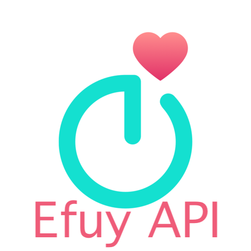

  

<h1 align="center">EufyLife API Integration for Home Assistant</h1>

[![GitHub Release][releases-shield]][releases]
[![License][license-shield]](LICENSE)
[![hacs][hacsbadge]][hacs]
[![Project Maintenance][maintenance-shield]][user_profile]
[![BuyMeCoffee][buymecoffeebadge]][buymecoffee]
[![Community Forum][forum-shield]][forum]

**This integration will set up the following platforms:**

| Platform | Description |
| -------- | ----------- |
| `sensor` | Show current weight, target weight, body fat, muscle mass, and BMI for each family member |

## Features

- 🔐 **Easy Setup**: Email/password authentication through Home Assistant UI
- ⚖️ **Weight Tracking**: Current weight and target weight sensors
- 📊 **Body Composition**: Body fat percentage, muscle mass, and BMI
- 👥 **Multi-User**: Supports multiple family members on the same scale
- 🔄 **Real-time Updates**: Automatic data synchronization with configurable intervals (1 min to 12 hours)
- ⚙️ **Configurable**: Adjust update frequency after setup without restarting Home Assistante

## Installation

### HACS (Recommended)

1. Have [HACS](https://hacs.xyz/) installed
2. In the HACS panel, go to "Integrations"
3. Click the "+ EXPLORE & DOWNLOAD REPOSITORIES" button
4. Search for "EufyLife API"
5. Download this integration
6. Restart Home Assistant
7. In the HA UI go to "Configuration" -> "Integrations" click "+" and search for "EufyLife API"

### Manual Installation

1. Using the tool of choice open the directory (folder) for your HA configuration (where you find `configuration.yaml`)
2. If you do not have a `custom_components` directory (folder) there, you need to create it
3. In the `custom_components` directory (folder) create a new folder called `eufylife_api`
4. Download _all_ the files from the `custom_components/eufylife_api/` directory (folder) in this repository
5. Place the files you downloaded in the new directory (folder) you created
6. Restart Home Assistant
7. In the HA UI go to "Configuration" -> "Integrations" click "+" and search for "EufyLife API"

## Configuration

Configuration is done through the Home Assistant UI:

1. Go to **Configuration** → **Integrations**
2. Click **Add Integration** and search for "EufyLife API"
3. Enter your EufyLife account credentials:
   - **Email**: Your EufyLife account email
   - **Password**: Your EufyLife account password
4. Choose your preferred update interval (default: 5 minutes)
5. The integration will automatically discover your devices and family members
6. Sensors will be created for each family member

### Update Intervals

You can configure how often the integration fetches new data:

- **1 minute**: For frequent weighing sessions
- **2 minutes**: For regular daily use
- **5 minutes**: Recommended default
- **10, 15, 30 minutes**: For moderate usage
- **1, 2, 6, 12 hours**: For occasional use

To change the update interval after setup:
1. Go to **Configuration** → **Integrations**
2. Find "EufyLife API" and click on it
3. Click the **Options** button
4. Select your desired update interval
5. Click **Submit**

## Supported Devices

- EufyLife smart scales connected to the EufyLife mobile app

## Sensors

For each family member, the integration creates the following sensors:

- **Weight** (`sensor.{name}_weight`) - Current weight in kg
- **Target Weight** (`sensor.{name}_target_weight`) - Weight goal in kg
- **Body Fat** (`sensor.{name}_body_fat`) - Body fat percentage
- **Muscle Mass** (`sensor.{name}_muscle_mass`) - Muscle mass in kg
- **BMI** (`sensor.{name}_bmi`) - Body Mass Index

### Device Information

Each family member appears as a separate device in Home Assistant with:
- Device name: "EufyLife Customer [ID]"
- Manufacturer: EufyLife
- Model: Smart Scale
- Last update timestamp and interval information

## API Details

This integration uses the official EufyLife API endpoints:

- **Authentication**: `POST /v1/user/v2/email/login`
- **Weight Data**: `GET /v1/customer/all_target`
- **Detailed Data**: `GET /v1/customer/target/{customer_id}`

## Limitations

- Requires active internet connection for cloud API access
- data are avaialbe after open the app in your phone
- Token expires after 30 days (automatic re-authentication planned for future versions)
- Historical data is limited to what's available via the current API endpoints

## Contributions are welcome!

If you want to contribute to this please read the [Contribution guidelines](.github/CONTRIBUTING.md)

## Disclaimer

This is an unofficial integration. EufyLife and Eufy are trademarks of Anker Innovations Limited.

---

[integration_blueprint]: https://github.com/ludeeus/integration_blueprint
[buymecoffee]: https://buymeacoffee.com/mshary
[buymecoffeebadge]: https://img.shields.io/badge/buy%20me%20a%20coffee-donate-yellow.svg?style=for-the-badge
[hacs]: https://github.com/hacs/integration
[hacsbadge]: https://img.shields.io/badge/HACS-Custom-orange.svg?style=for-the-badge
[exampleimg]: .github/logo.png
[forum-shield]: https://img.shields.io/badge/community-forum-brightgreen.svg?style=for-the-badge
[forum]: https://community.home-assistant.io/
[license-shield]: https://img.shields.io/github/license/m4ary/eufylife-api-hacs.svg?style=for-the-badge
[maintenance-shield]: https://img.shields.io/badge/maintainer-%40mshary-blue.svg?style=for-the-badge
[releases-shield]: https://img.shields.io/github/release/m4ary/eufylife-api-hacs.svg?style=for-the-badge
[releases]: https://github.com/m4ary/eufylife-api-hacs/releases
[user_profile]: https://github.com/m4ary 