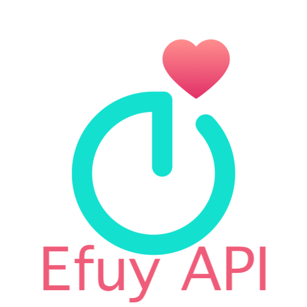

<p align="center">
  
</p>

<h1 align="center">EufyLife API Integration for Home Assistant</h1>

[![GitHub Release][releases-shield]][releases]
[![License][license-shield]](LICENSE)
[![hacs][hacsbadge]][hacs]
[![Project Maintenance][maintenance-shield]][user_profile]
[![BuyMeCoffee][buymecoffeebadge]][buymecoffee]
[![Community Forum][forum-shield]][forum]

**This integration will set up the following platforms:**

| Platform | Description |
| -------- | ----------- |
| `sensor` | Show current weight, target weight, body fat, muscle mass, and BMI for each family member |
| `light` | Discover and control Eufy E10 lights (Outdoor Pathway T8L30, Indoor Floor Lamp T8L40) through the Eufy Life cloud |

## Features

- 🔐 **Easy Setup**: Email/password authentication through Home Assistant UI
- ⚖️ **Weight Tracking**: Current weight and target weight sensors
- 📊 **Body Composition**: Body fat percentage, muscle mass, and BMI
- 👥 **Multi-User**: Supports multiple family members on the same scale
- 🔄 **Real-time Updates**: Automatic data synchronization with configurable intervals (1 min to 12 hours)
- ⚙️ **Configurable**: Adjust update frequency after setup without restarting Home Assistante
- 💡 **E10 Lights**: On/off, brightness, native RGBWW picker (including warm/cool white LEDs), classic presets and segmented control for Eufy E10 series (Outdoor Pathway T8L30 and Indoor Floor Lamp T8L40)

## Installation

### HACS (Recommended)

1. Have [HACS](https://hacs.xyz/) installed
2. In the HACS panel, go to "Integrations"
3. Click the "+ EXPLORE & DOWNLOAD REPOSITORIES" button
4. Search for "EufyLife API"
5. Download this integration
6. Restart Home Assistant
7. In the HA UI go to "Configuration" -> "Integrations" click "+" and search for "EufyLife API"

### Manual Installation

1. Using the tool of choice open the directory (folder) for your HA configuration (where you find `configuration.yaml`)
2. If you do not have a `custom_components` directory (folder) there, you need to create it
3. In the `custom_components` directory (folder) create a new folder called `eufylife_api`
4. Download _all_ the files from the `custom_components/eufylife_api/` directory (folder) in this repository
5. Place the files you downloaded in the new directory (folder) you created
6. Restart Home Assistant
7. In the HA UI go to "Configuration" -> "Integrations" click "+" and search for "EufyLife API"

## Configuration

Configuration is done through the Home Assistant UI:

1. Go to **Configuration** → **Integrations**
2. Click **Add Integration** and search for "EufyLife API"
3. Enter your EufyLife account credentials:
   - **Email**: Your EufyLife account email
   - **Password**: Your EufyLife account password
4. Choose your preferred update interval (default: 5 minutes)
5. The integration will automatically discover your devices and family members
6. Scale sensors and E10 light entities will be created for supported devices

Use the same direct email/password login that works in the Eufy Life app. Accounts
created with Google or Apple sign-in may need a Eufy password set or reset first.

### Update Intervals

You can configure how often the integration fetches new data:

- **1 minute**: For frequent weighing sessions
- **2 minutes**: For regular daily use
- **5 minutes**: Recommended default
- **10, 15, 30 minutes**: For moderate usage
- **1, 2, 6, 12 hours**: For occasional use

To change the update interval after setup:
1. Go to **Configuration** → **Integrations**
2. Find "EufyLife API" and click on it
3. Click the **Options** button
4. Select your desired update interval
5. Click **Submit**

## Supported Devices

- EufyLife smart scales connected to the EufyLife mobile app
- Eufy E10 lights, including Outdoor Pathway Lights (`T8L30`) and Indoor Floor Lamp (`T8L40`), cloud control including shared accounts

### Validation

If you have a light that is not being discovered, you can run a validation script to see which devices are linked to your account:

1. Install dependencies: `pip install aiohttp cryptography paho-mqtt`
2. Run the script: `python3 scripts/validate_lights.py`
3. Enter your EufyLife credentials when prompted.

The script will list all lights found in your account along with their model IDs,
and provides an interactive menu to test power, brightness, colors and effects.
Use the `d` option in the control menu to dump the raw effects catalog for
troubleshooting skipped presets.

### E10 light controls

Open the light's more-info panel for brightness, the native RGBWW picker (supporting
R, G, B, Warm White, and Cold White LEDs) and the effect selector. Classic presets
are discovered from the account's Eufy catalog; the tested E10 exposes White, Warm
White, Cool White, Welcome1, Alarm1 and Alexa1. Existing `light.turn_on`/`light.turn_off`
automations keep working.

```yaml
action: light.turn_on
target:
  entity_id: light.eufy_e10_light
data:
  brightness_pct: 50
  rgbww_color: [255, 128, 0, 255, 0]
```

Replace `rgbww_color` with `effect: Warm White` to select a preset. Select a color
or a preset, not both. Brightness is retained unless supplied in the action.
Power/brightness come from device reports; color/effect are remembered only
after a successful device ACK and are marked assumed in HA. The palette cannot
yet be read back, including after restarting HA or changing colors in the app
without changing modes.

### Advanced Controls (Segmented DIY Mode)

For more advanced control, such as setting different colors for each lamp segment,
adjusting animation speed or direction, use the `eufylife_api.set_light_settings` service:

```yaml
action: eufylife_api.set_light_settings
target:
  entity_id: light.eufy_e10_light
data:
  colors:
    - [255, 0, 0]      # Segment 1: Red
    - [0, 255, 0]      # Segment 2: Green
    - [0, 0, 255]      # Segment 3: Blue
    - [255, 255, 0, 255, 0] # Segment 4: Yellow + Warm White
  speed: 5             # 1 (slow) to 10 (fast)
  direction: 1         # 0 or 1
```

The `colors` list must have exactly as many entries as there are segments in your
light (check the `lamp_count` attribute of the entity). Each entry can be a
3-tuple `[R, G, B]` or a 5-tuple `[R, G, B, W, C]`.

## Sensors

For each family member, the integration creates the following sensors:

- **Weight** (`sensor.{name}_weight`) - Current weight in kg
- **Target Weight** (`sensor.{name}_target_weight`) - Weight goal in kg
- **Body Fat** (`sensor.{name}_body_fat`) - Body fat percentage
- **Muscle Mass** (`sensor.{name}_muscle_mass`) - Muscle mass in kg
- **BMI** (`sensor.{name}_bmi`) - Body Mass Index

### Device Information

Each family member appears as a separate device in Home Assistant with:
- Device name: "EufyLife Customer [ID]"
- Manufacturer: EufyLife
- Model: Smart Scale
- Last update timestamp and interval information

## API Details

This integration uses the official EufyLife API endpoints:

- **Authentication**: `POST /v1/user/v2/email/login`
- **Weight Data**: `GET /v1/customer/all_target`
- **Detailed Data**: `GET /v1/customer/target/{customer_id}`
- **E10 discovery**: encrypted Eufy Life AIoT device-list API
- **E10 state/control**: certificate-authenticated Eufy Life MQTT


## Limitations

- Requires active internet connection for cloud API access
- E10 newer-format animated/AI presets are not implemented; unsupported catalog entries are hidden
- data are avaialbe after open the app in your phone
- Token expires after 30 days (automatic re-authentication planned for future versions)
- Historical data is limited to what's available via the current API endpoints

## Contributions are welcome!

If you want to contribute to this please read the [Contribution guidelines](.github/CONTRIBUTING.md)


## Disclaimer

This is an unofficial integration. EufyLife and Eufy are trademarks of Anker Innovations Limited.

---

[integration_blueprint]: https://github.com/ludeeus/integration_blueprint
[buymecoffee]: https://buymeacoffee.com/mshary
[buymecoffeebadge]: https://img.shields.io/badge/buy%20me%20a%20coffee-donate-yellow.svg?style=for-the-badge
[hacs]: https://github.com/hacs/integration
[hacsbadge]: https://img.shields.io/badge/HACS-Custom-orange.svg?style=for-the-badge
[exampleimg]: .github/logo.png
[forum-shield]: https://img.shields.io/badge/community-forum-brightgreen.svg?style=for-the-badge
[forum]: https://community.home-assistant.io/
[license-shield]: https://img.shields.io/github/license/m4ary/eufylife-api-hacs.svg?style=for-the-badge
[maintenance-shield]: https://img.shields.io/badge/maintainer-%40mshary-blue.svg?style=for-the-badge
[releases-shield]: https://img.shields.io/github/release/m4ary/eufylife-api-hacs.svg?style=for-the-badge
[releases]: https://github.com/m4ary/eufylife-api-hacs/releases
[user_profile]: https://github.com/m4ary
